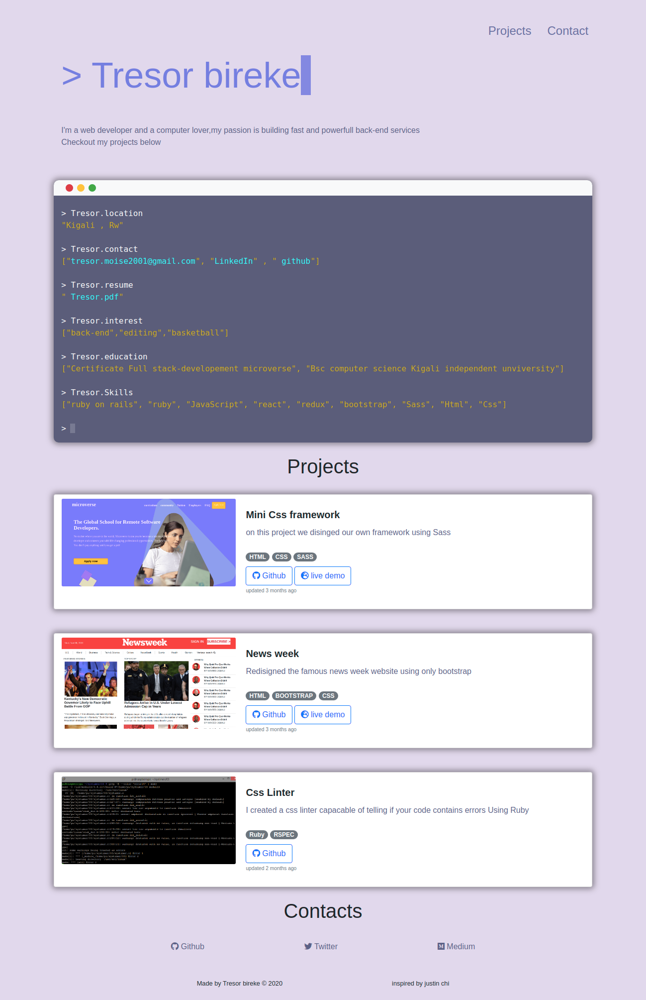

# Portfolio

> This repo contains the first version of my personal portfolio



This is a simple portfolio that i built based justin chin's design using boostrap,css and sass

## Built With

- html,
- bosstrap,
- sass,

## Live Demo

[Port folio Live Demo](https://tresor11.github.io/portfolio/)


## Getting Started


To get a local copy up and running follow these simple example steps.

### Setup
1. Clone the repo ``` git clone https://github.com/Tresor11/portfolio.git  ```
2. run your local server

## Author

👤 **Tresor Bireke**

- Github: [@Tresor11](https://github.com/Tresor11)
- Twitter: [@TBireke](https://twitter.com/TBireke)
- Linkedin: [Tresor Bireke Muhigirwa](https://www.linkedin.com/in/tr%C3%A9sor-bireke-3b7443188/
)

## 🤝 Contributing

Contributions, issues and feature requests are welcome!

Feel free to check the [issues page](issues/).

## Show your support

Give a ⭐️ if you like this project!

## Acknowledgments

- Hat tip to Justin chi for the inspiration
- microverse

## 📝 License

This project is [MIT](lic.url) licensed.
